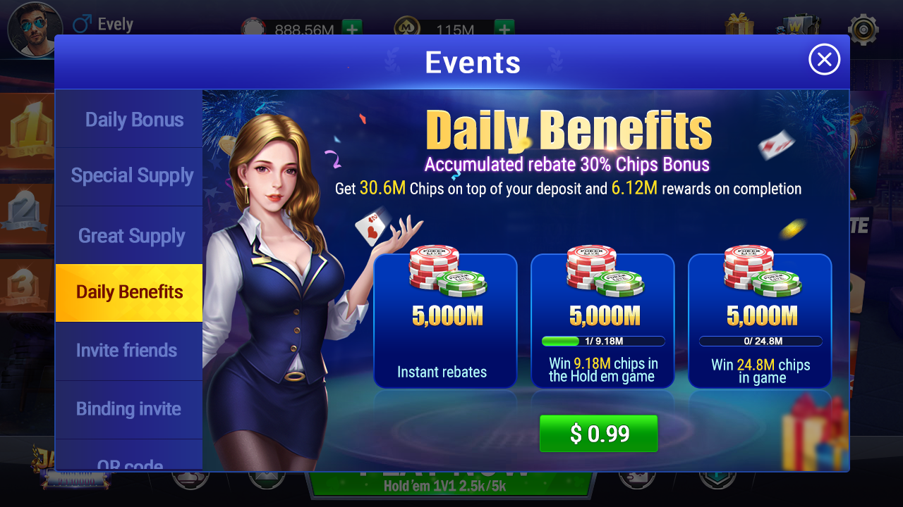
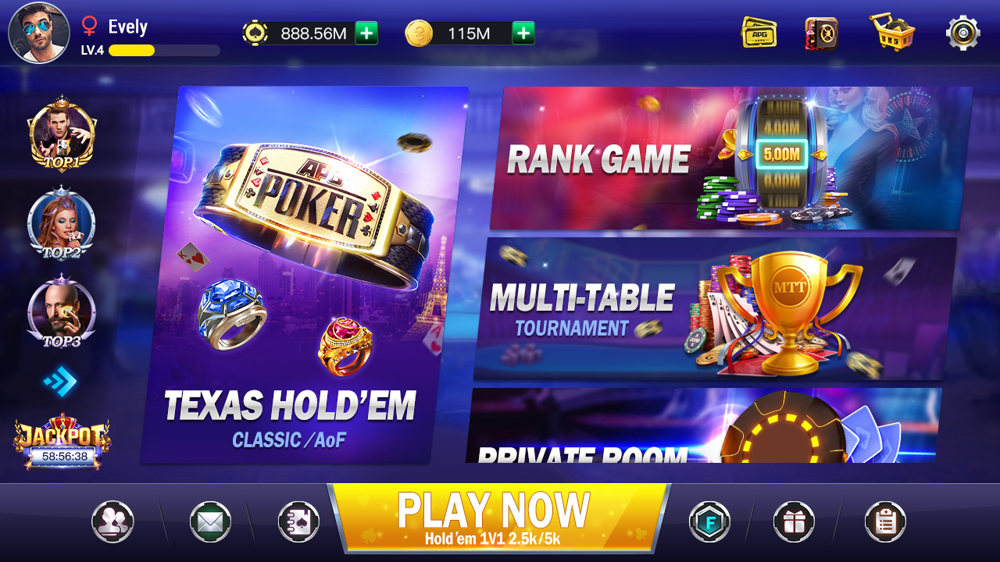
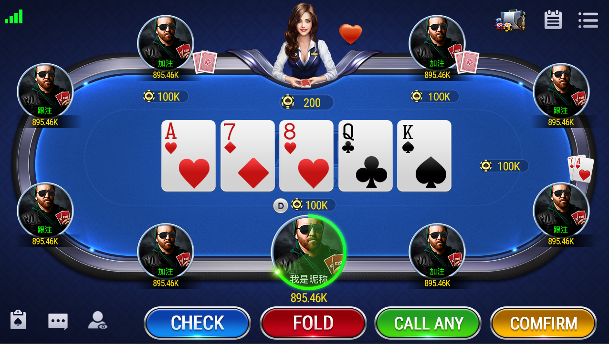
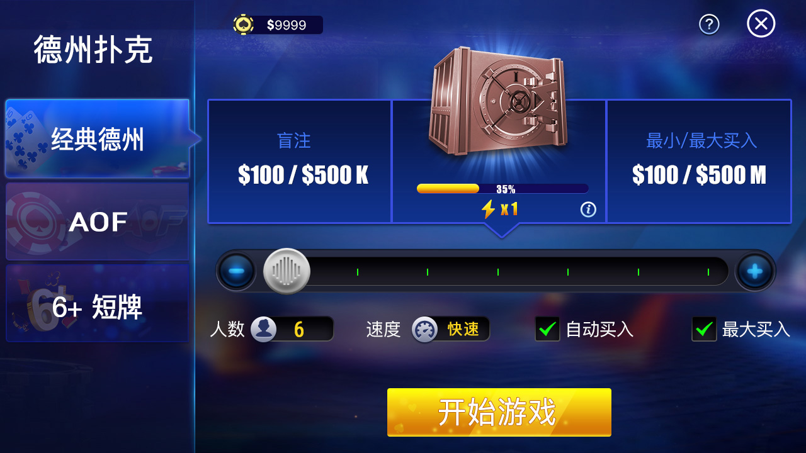
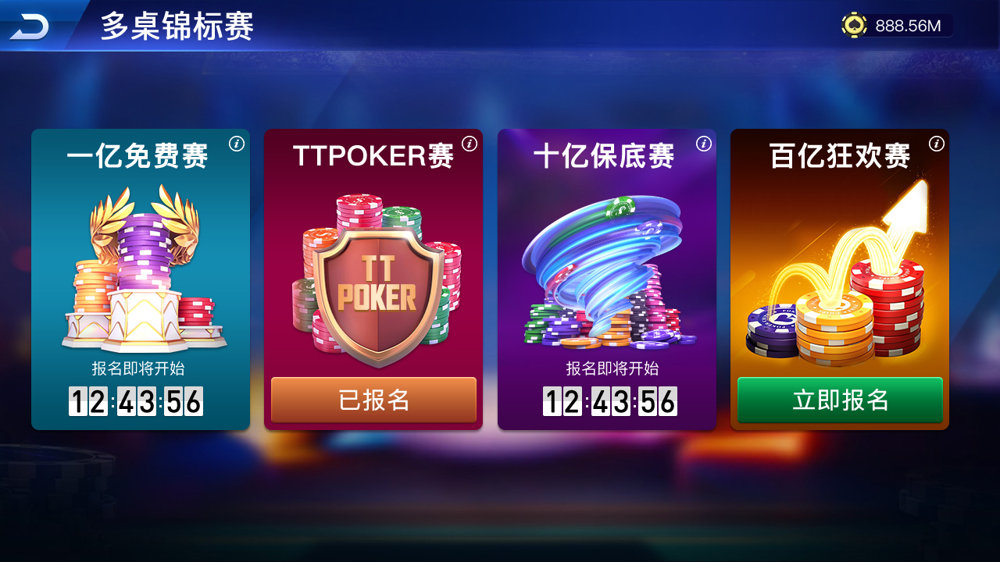
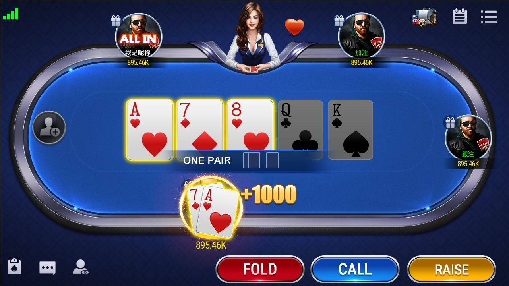
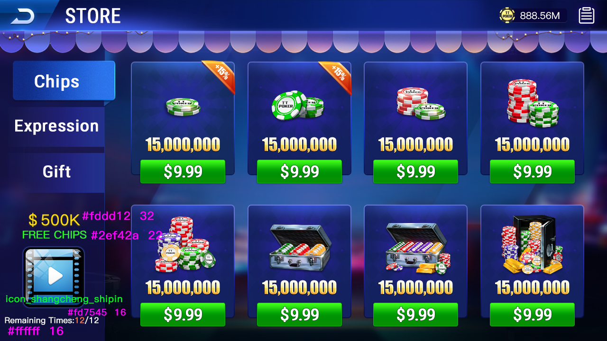
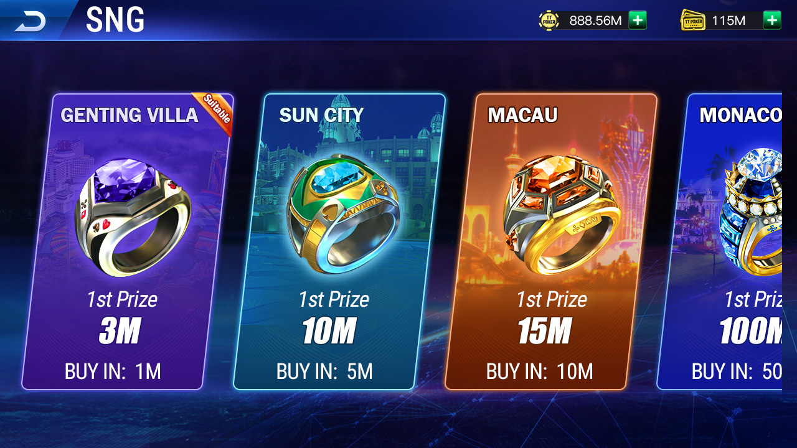

# 德州积分大厅源码｜德州金币大厅源码｜Commercial Texas Hold'em Gold Coin Lobby Source Code | High-Revenue Poker Platform， 6 种玩法 | 完整运营后台 

<p align="center">
  
  
  
  
  
</p>


[简体中文](README.md) | [English](README.en.md) | [繁體中文](README.zh-TW.md)


<h1 align="center">🃏 Texas Hold'em Coin Lobby</h1>

<p align="center">
  <b>德州金币大厅源码 / 德州积分大厅源码 — 商业级棋牌游戏平台</b><br>
  <b>Commercial Texas Hold'em Gold Coin Lobby Source Code | High-Revenue Poker Platform</b><br>
  <b>支持 iOS / Android 上架 | 6 种玩法 | 完整运营后台 | 快速二次开发</b>
</p>

<p align="center">
  <a href="#核心玩法">🎮 6种玩法</a> •
  <a href="#系统功能">🛒 商城系统</a> •
  <a href="#运营活动">🎁 运营活动</a> •
  <a href="#技术架构">⚙️ 技术架构</a> •
  <a href="#部署指南">🚀 快速部署</a>
</p>

---

## 📑 目录

- [项目简介](#项目简介)
- [核心玩法](#核心玩法)
- [系统功能](#系统功能)
- [运营活动](#运营活动)
- [技术架构](#技术架构)
- [多语言支持](#多语言支持)
- [上架支持](#上架支持)
- [快速二开](#快速二开)
- [项目结构](#项目结构)
- [部署指南](#部署指南)
- [常见问题](#常见问题)
- [许可证](#许可证)
- [联系我们](#联系我们)

---

## 项目简介

**Texas Hold'em Coin Lobby（德州金币大厅 / 德州积分大厅）** 是一套完整的**商业级棋牌游戏平台源码**

本系统包含 **6 种核心扑克玩法**、**完整的商城与社交系统**、**丰富的运营活动模块**，以及 **Java SpringBoot 运营后台**，支持**中文、英文等多语言**。


| 语言 | 项目名称 |
|------|---------|
| 中文 | 德州金币大厅源码 / 德州积分大厅源码  |
| English | Texas Hold'em Coin Lobby Source Code / Poker Gold Platform |

---

## 核心玩法

本系统内置 **6 种经典扑克玩法**，覆盖休闲玩家到职业牌手全场景：

| 玩法 | 说明 | 特点 |
|------|------|------|
| ♠️ 经典德州扑克 | No-Limit Texas Hold'em | 标准 52 张牌，全球最流行的扑克玩法 |
| 🎯 AOF 全押或弃牌 | All-in or Fold | 每手牌必须全押或弃牌，极速刺激 |
| 🃏 6+ 短牌德州 | Short Deck / 6+ Hold'em | 去除 2-5 牌，顺子更易成牌，节奏更快 |
| ⚡ 单桌锦标赛 | SNG (Sit & Go) | 满人即开，快速结算，适合碎片化时间 |
| 🏆 多桌锦标赛 | MTT (Multi-Table Tournament) | 支持千人级参赛，淘汰晋级机制 |
| 🏢 俱乐部模式 | Club Mode | 私人牌桌、朋友局、俱乐部联盟|

---

## 系统功能


- 🛍️ **商城系统** — 金币/钻石、道具购买、VIP 礼包、限时折扣
- 👤 **个人中心** — 头像、昵称、战绩、资产、等级、成就系统
- 🎁 **宝箱系统** — 青铜/白银/黄金/钻石宝箱，定时开启奖励
- 📊 **排行榜** — 日榜/周榜/月榜/总榜，财富榜/胜率榜/牌局榜
- 🔒 **保险箱** — 金币存入保险，防止大额损失，提升留存
- 👫 **好友系统** — 添加好友、私聊、查看好友战绩、邀请对战
- ✉️ **邮件系统** — 系统公告、活动奖励、补偿发放、客服回复
- 🔗 **Facebook 登录** — FB 一键登录、好友邀请、战绩分享
- ⚙️ **设置中心** — 音效、音乐、语言切换、通知管理、账号安全

---

## 运营活动

内置 **9 大运营活动模块**，助力快速拉新、促活、留存：

| 活动 | 功能描述 | 运营目标 |
|------|---------|---------|
| 📜 任务系统 | 每日/每周/成长任务，完成任务领金币 | 留存、活跃 |
| 📅 每日登录 | 连续登录奖励，第 7 天大奖 | 日活、留存 |
| 🎪 活动中心 | 限时活动聚合页，节日专题活动 | 促活、变现 |
| 🚀 邀请好友 | 邀请码裂变，双方得金币奖励 | 拉新、裂变 |
| 💰 JackPot 奖池 | 全局累积奖池，随机触发大奖 | 刺激、留存 |
| 🎫 刮刮乐彩票 | 虚拟刮刮卡，即时开奖 | 趣味、活跃 |
| 🎡 转盘活动 | 幸运大转盘，免费/付费抽奖 | 、活跃 |
| 📺 免费看广告 | 观看激励视频广告得金币 | 广告盈利，零氪留存 |

---

## 技术架构

| 层级 | 技术 | 说明 |
|------|------|------|
| 客户端 | Unity 2022.3 LTS | 跨平台支持 iOS / Android / H5，热更新方案内置 |
| 游戏服务端 | C++17 / Boost.Asio | 高性能游戏逻辑服务器，单节点 10,000+ 并发 |
| 运营后台 | Java + SpringBoot + Vue3 | 完整的运营管理系统，数据可视化 |
| 数据库 | MySQL 8.0 + Redis 7.0 | 主从复制 + 集群缓存，支撑高并发读写 |
| 网络协议 | WebSocket + Protobuf | 低延迟实时通信，平均延迟 < 50ms |
| 消息队列 | RabbitMQ | 异步任务、削峰填谷、日志处理 |
| 部署 | Docker + Kubernetes | 容器化部署，一键扩缩容 |
| 监控 | Prometheus + Grafana | 实时性能监控、告警、运营数据看板 |

---


### 可快速替换模块

| 模块 | 替换方式 | 预计工时 |
|------|---------|---------|
| 🎨 UI 界面 | 替换 Unity UI 预制体 + 图集 | 1-3 天 |
| 🃏 扑克牌面/桌布 | 替换 Sprite 资源 | 2-4 小时 |
| 🎵 音效音乐 | 替换 AudioClip 资源 | 2-4 小时 |
| 🏷️ 游戏名称/Logo | 修改配置表 + 替换启动图 | 2-4 小时 |
| 💰 充值档位 | 修改后台配置表 | 30 分钟 |
| 🎁 活动奖励 | 修改后台运营配置 | 30 分钟 |
| 🌐 新增语言 | 翻译 JSON 语言包 | 1-2 天 |

### 二开示例：修改游戏名称

```bash
# 1. 修改客户端配置
vim Client/Assets/Resources/Config/AppConfig.json
# 修改 "AppName": "你的游戏名"

# 2. 修改服务端配置
vim Server/Config/game.conf
# 修改 app_name = "你的游戏名"

# 3. 修改运营后台配置
vim Admin/src/main/resources/application.yml
# 修改 app.name: 你的游戏名

# 4. 重新打包
./build.sh
```

---

## 项目结构

```text
texas-holdem-coin-lobby/
├── Client/                    # Unity 客户端
├── Server/                    # C++ 游戏服务端
├── Docs/                      # 部署文档、API 文档、上架指南
└── README.md                  # 本文件
```

---

## 部署指南

### 环境要求

- **OS**: Ubuntu 20.04+ / CentOS 8+
- **Compiler**: GCC 9.4+ / Clang 12+
- **Build**: CMake 3.20+
- **DB**: MySQL 8.0+ / Redis 6.0+
- **Java**: JDK 11+ / Maven 3.6+
- **Client**: Unity 2022.3 LTS

### Docker 一键部署（推荐）

```bash
# 1. 克隆仓库
git clone https://github.com/alibabamayun888/texas-holdem-coin-lobby.git
cd texas-holdem-coin-lobby

# 2. 启动全部服务（服务端 + 数据库 + 运营后台）
docker-compose up -d

# 3. 检查服务状态
docker-compose ps

# 4. 查看游戏服务端日志
docker-compose logs -f gameserver

# 5. 访问运营后台
open http://localhost:8080/admin
# 默认账号: admin / admin123
```

### 手动编译部署

```bash
# 编译游戏服务端
cd Server
mkdir build && cd build
cmake .. -DCMAKE_BUILD_TYPE=Release
make -j$(nproc)

# 编译运营后台
cd ../Admin
mvn clean package -DskipTests

# 启动服务
./Server/build/GameServer --config=../Config/server.conf
java -jar Admin/target/admin-1.0.0.jar
```

---
---
## 产品截图

















## 联系我们

| 渠道 | 联系方式 |
|------|---------|
| 📧 Email | ttpoker40@gmail.com |
| 💬 Telegram | [@alibabama401](https://t.me/alibabama401) |

---
## 常见问题

**Q1: 这个项目可以商用吗？需要授权吗？**

A: 源码仅供学习研究

**Q2: 支持哪些平台？可以上架 App Store 吗？**

A: 支持 iOS 12+ 和 Android 5+。

**Q3: 二次开发难度大吗？需要多少人团队？**

A: 模块化设计，UI/音效/配置均可快速替换。最小团队 1 名 Unity 开发 + 1 名服务端开发即可在。

**Q4: 最大支持多少人在线？**

A: 单节点部署支持 10,000 并发，通过 K8s 横向扩展可支撑百万级 DAU。

**Q5: 数据库用 MySQL ？**

A: 当前版本使用 MySQL 8.0。。

**Q6: 如何接入自己的支付渠道？**

A: 客户端 `Client/Assets/Scripts/Payment/` 目录已预留支付接口模板，按文档接入即可。运营后台同步配置支付参数。

**Q7: 是否支持热更新？**

A: 支持。Unity 客户端采用 AssetBundle + Addressables 热更新方案，无需重新打包即可更新 UI 和活动配置。

**Q8: 运营后台有哪些功能？**

A: 运营后台包含：玩家管理、订单管理、活动配置、GM 工具、数据报表、分销管理、风控审计、客服系统。


## 许可证

本项目采用自定义许可证。

- 📚 **学习用途**：允许自由下载、学习、研究
- ⚠️ **禁止**：未经授权的转售、分发、SaaS 化运营

This software is provided for **learning, research, and demonstration purposes only**. Commercial use requires a separate license agreement.


<p align="center">
  <b>⭐ 如果这个项目对你有帮助，请点个 Star 支持一下！⭐</b><br>
  <i>If this project helps you, please give it a star and share it with your friends!</i><br><br>
  <a href="https://github.com/alibabamayun888/texas-holdem-coin-lobby/stargazers">
    
  </a>
</p>
